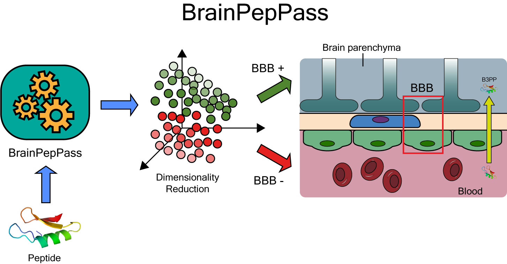

# BrainPepPass
BrainPepPass: A framework based on supervised dimensionality reduction for predicting blood-brain barrier-penetrating peptides.

### Overview

BrainPepPass is a machine learning-based framework that uses a supervised manifold dimensionality reduction and eXtreme Gradient Boosting algorithms to predict if natural and chemically modified monomeric peptides can cross or not the blood-brain barrier (BBB). This computational tool uses structural and physiochemical properties extracted from peptides to predict the permeability. 

The online versions of the BrainPepPass available are based on the best select model that encompasses the feature composition (FC)-4, as described in the paper "BrainPepPass: A framework based on supervised dimensionality reduction for predicting blood-brain barrier-penetrating peptides".

 

    

### Google Colab version
The Google Colab version of the BrainPepPass framework is an online tool where users can upload their peptides files and predict their permeability across the BBB. The users can access this version [here](https://colab.research.google.com/drive/1O-obGm1mN7RdyevRzs3h0uQ0ZtIsNCa_?usp=sharing). The user manual can be downloaded [here](https://github.com/ewerton-cristhian/BrainPepPass/blob/master/manual/user_manual_BrainPepPass.pdf).

:key: To access this version of BrainPepPass, the user must have a free Google account.

📈 The Google Colab version of the BrainPepPass trained with all the available and unbalanced dataset (BrainPepPass 2.0) can be accessed [here](https://colab.research.google.com/drive/1l_j7KPp-nBwsGv-s8bzMA7ATCEixQmPo?usp=sharing). This version does not match the best model described in the paper, but a useful model that can predict BBB permeability for a wider range of peptides. 

:exclamation: Currently, only peptides encoded in .mol format are accepted in BrainPepPass. Soon we will be making available the option to upload peptides in other formats. If the user has peptides in other formats, it is possible to convert their structures to .mol ​​(MDL Mol File) using the online [Babel tool](https://chemdb.ics.uci.edu/cgibin/BabelWeb.py).

### Web server version
:warning: The web server with the BrainPepPass framework is under deployment. This tool will be available soon for users.

### Contacts
The BrainPepPass is scientific colaboration of Federal University of Western Pará (Universidade Federal do Oeste do Pará, Brazil), Federal University of Pará (Universidade Federal do Pará, Brazil) and Univerity of Ghent (Belgium).
In case of doubts about the use, scientific partnerships or improvements in the algorithm do not hesitate to contact us.

* Kauê Santana E-mail: kaue.costa@ufopa.edu.br
* Anderson Henrique Lima E-mail: anderson@ufpa.br
* Bart De Spiegeleer E-mail: Bart.DeSpiegeleer@ugent.be
* Claudomiro Sales E-mail: cssj@ufpa.br
* Ewerton Cristhian Lima de Oliveira: ewerton.o43@gmail.com
